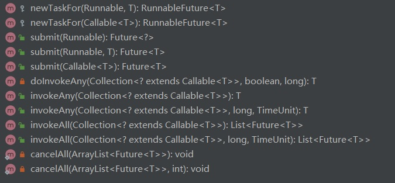

# AbstractExecutorService解析

### 0、位置

```java
package java.util.concurrent;
```


### 1、功能介绍

提供了 接口ExecutorService的实现

### 2、方法



```java
protected <T> RunnableFuture<T> newTaskFor(Runnable runnable, T value)
```

说明：创建新Future任务

```java
protected <T> RunnableFuture<T> newTaskFor(Callable<T> callable)
```

说明：创建新Future任务

```java
public Future<?> submit(Runnable task)
```

说明：执行任务并返回结果

```java
public <T> Future<T> submit(Runnable task, T result)
```

说明：执行任务并返回结果

```java
public <T> Future<T> submit(Callable<T> task)
```

说明：执行任务并返回结果

```java
private <T> T doInvokeAny(Collection<? extends Callable<T>> tasks,
                              boolean timed, long nanos)
```

说明：批量执行任务并返回结果

```java
public <T> T invokeAny(Collection<? extends Callable<T>> tasks)
```

说明：批量执行任务并返回结果

```java
public <T> T invokeAny(Collection<? extends Callable<T>> tasks,
                           long timeout, TimeUnit unit)
```

说明：批量执行任务并返回结果

```java
public <T> List<Future<T>> invokeAll(Collection<? extends Callable<T>> tasks)
```

说明：批量执行任务并返回结果集

```java
public <T> List<Future<T>> invokeAll(Collection<? extends Callable<T>> tasks,
                                         long timeout, TimeUnit unit)
```

说明：批量执行任务并返回结果集

```java
private static <T> void cancelAll(ArrayList<Future<T>> futures)
```

说明:批量取消任务并返回结果

```java
private static <T> void cancelAll(ArrayList<Future<T>> futures, int j)
```

说明：批量取消任务并返回结果

