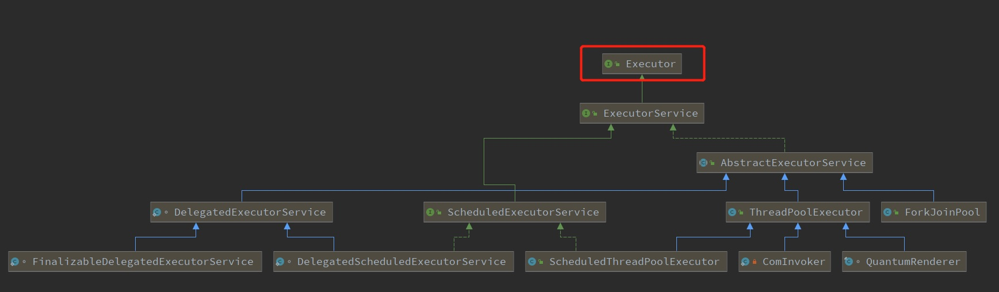

# Executor解析

### 0、位置

```java
package java.util.concurrent
```


### 1、功能介绍

Executor是一个接口,他的实现类是ExecutorService

>  功能:他是一个执行器接口，用于执行线程任务，他们实现类中会具备调度任务的功能，如启动，停止，唤醒，提交等功能

### 2、关系图



### 3、方法

```java
void execute(Runnable command);
```


